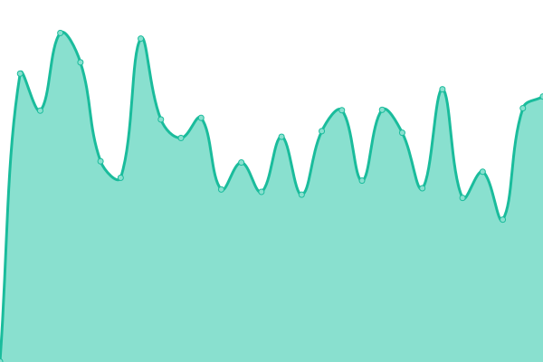
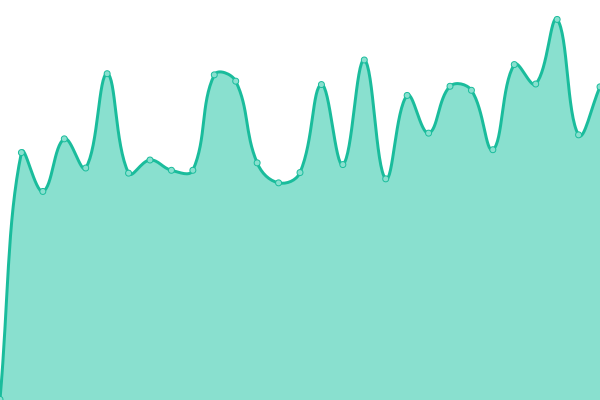
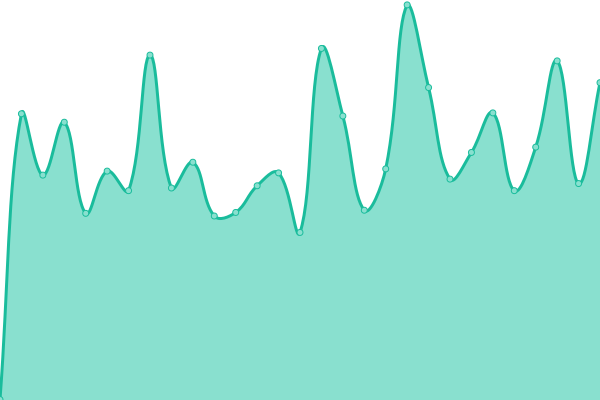

# [📈 Live Status](https://status.zefyrswap.com): <!--live status--> **🟥 Complete outage**

This repository contains the open-source uptime monitor and status page for [Petrate](https://status.zefyrswap.com), powered by [Upptime](https://github.com/upptime/upptime).

With [Upptime](https://upptime.js.org), you can get your own unlimited and free uptime monitor and status page, powered entirely by a GitHub repository. We use [Issues](https://github.com/devpetrate/zefyrswap-status/issues) as incident reports, [Actions](https://github.com/devpetrate/zefyrswap-status/actions) as uptime monitors, and [Pages](https://status.zefyrswap.com) for the status page.

<!--start: status pages-->
<!-- This summary is generated by Upptime (https://github.com/upptime/upptime) -->
<!-- Do not edit this manually, your changes will be overwritten -->
<!-- prettier-ignore -->
| URL | Status | History | Response Time | Uptime |
| --- | ------ | ------- | ------------- | ------ |
|  [Google Test](https://www.google.com) | 🟥 Down | [google-test.yml](https://github.com/devpetrate/zefyrswap-status/commits/HEAD/history/google-test.yml) | 

 94ms
     
 | 

<a href="https://status.zefyrswap.com/history/google-test">100.00%</a>
    

|  [ZefyrSwap](https://zefyrswap.com) | 🟥 Down | [zefyr-swap.yml](https://github.com/devpetrate/zefyrswap-status/commits/HEAD/history/zefyr-swap.yml) | 

 316ms
     
 | 

<a href="https://status.zefyrswap.com/history/zefyr-swap">100.00%</a>
    

|  [ZefyrSwap API](https://api.zefyrswap.com) | 🟥 Down | [zefyr-swap-api.yml](https://github.com/devpetrate/zefyrswap-status/commits/HEAD/history/zefyr-swap-api.yml) | 

 293ms
     
 | 

<a href="https://status.zefyrswap.com/history/zefyr-swap-api">100.00%</a>
    

|  [ZefyrSwap App](https://app.zefyrswap.com) | 🟥 Down | [zefyr-swap-app.yml](https://github.com/devpetrate/zefyrswap-status/commits/HEAD/history/zefyr-swap-app.yml) | 

 342ms
     
 | 

<a href="https://status.zefyrswap.com/history/zefyr-swap-app">100.00%</a>
    

<!--end: status pages-->

[**Visit our status website →**](https://status.zefyrswap.com)

## 📄 License

- Powered by: [Upptime](https://github.com/upptime/upptime)
- Code: [MIT](./LICENSE) © [Anand Chowdhary](https://anandchowdhary.com), supported by [Pabio](https://pabio.com)
- Data in the `./history` directory: [Open Database License](https://opendatacommons.org/licenses/odbl/1-0/)
